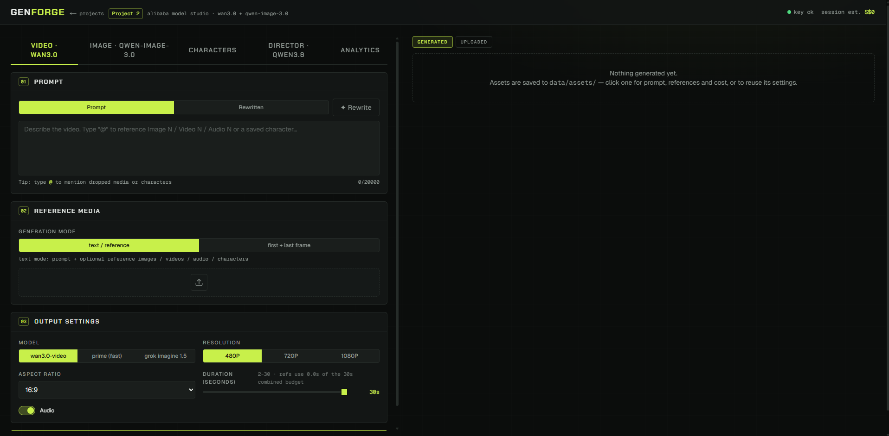

# GENFORGE

GENFORGE is a local, project-based content studio for generating and organizing images, videos, storyboards, characters, and reference media. It uses Alibaba Cloud Model Studio (DashScope) for Qwen and Wan models, with optional OpenRouter support for additional image and video models.

It is designed as an all-in-one, story-to-video workspace in the spirit of OpenArt and Higgsfield: develop a premise, turn it into a storyboard, establish reusable characters and reference media, generate images and video, then keep every output organized in the same project. Rather than moving between separate writing, image, video, and asset-management tools, GENFORGE keeps the full creative workflow in one local app.



## What it does

- Create separate projects for a shoot, client, or campaign. Each project keeps its generated assets, storyboards, characters, and uploads together. Deleting a project only makes its contents unassigned; it does not delete their files.
- Generate videos with `wan3.0-video` or `wan3.0-video-prime`, including text-to-video and reference-driven requests. The optional QwenCloud provider also exposes first/last-frame generation.
- Generate images with `qwen-image-3.0-pro` or `qwen-image-3.0`, including image editing with up to three reference images.
- Use OpenRouter models by selecting the built-in Nano Banana 2 (`google/gemini-3.1-flash-image`), Grok Imagine Video, or entering another supported `provider/model` ID.
- Keep a character library with reference images, an optional voice sample, and a reusable description. Attaching a character adds its reference media and identity-binding prompt text to a generation.
- Use Director to turn a premise and cast into a storyboard in your house style, then revise and save versions. Video Prompt Rewrite formats a prompt and its attached material into a structured Wan reference-to-video request.
- Save generated results and uploaded image/audio files locally, browse them in the asset library, download or reuse generation settings, and move/copy items between projects.
- Review estimated, not authoritative, costs for assets and Director/Rewrite runs in Analytics. Rates can be changed with environment variables.

Generated media, references, characters, projects, uploads, and analytics records are stored under `data/`, which is intentionally ignored by Git. Generated results are downloaded into the asset library so they remain available after a provider URL expires. Pending video jobs are persisted and resume polling after a page reload.

## Quick start

Prerequisites: Node.js 20 or newer and a DashScope API key for the region you plan to use.

1. Install dependencies:

   ```bash
   npm install
   ```

2. Create `.env.local` from the provided template, then add your DashScope key:

   ```powershell
   Copy-Item .env.example .env.local
   ```

   ```dotenv
   DASHSCOPE_API_KEY=sk-your-key
   ```

3. Start the development server:

   ```bash
   npm run dev
   ```

4. Open [http://localhost:3000](http://localhost:3000), create a project, and open it to begin generating.

The app can open without a key, but DashScope generation, Director, and Rewrite require `DASHSCOPE_API_KEY`. Restart the server after changing `.env.local`.

## Configuration

Use `.env.example` as the complete reference. `.env.local` is read directly by the server and takes precedence over an OS-level `DASHSCOPE_API_KEY`. Never commit a real API key; `.env.local` and `data/` are already gitignored.

| Variable | Required for | Notes |
| --- | --- | --- |
| `DASHSCOPE_API_KEY` | DashScope image/video generation, Director, Rewrite | International/Singapore keys use the default international endpoint. |
| `DASHSCOPE_BASE_URL` | Non-default DashScope region or workspace endpoint | Beijing keys require `https://dashscope.aliyuncs.com`. The default is `https://dashscope-intl.aliyuncs.com`. |
| `OPENROUTER_API_KEY` | Nano Banana 2, Grok Imagine Video, and custom OpenRouter models | Uses `https://openrouter.ai/api/v1` by default. |
| `VIDEO_PROVIDER=qwencloud` | QwenCloud video generation | Also set `QWENCLOUD_API_KEY`; `QWENCLOUD_BASE_URL` is optional. This enables first/last-frame mode. |
| `DIRECTOR_MODEL`, `REWRITE_MODEL`, `APPEARANCE_MODEL` | Optional model overrides | Defaults are documented in `.env.example`. |
| `PRICE_*` | Cost display only | These are editable USD estimates, not provider billing records. |

DashScope keys are region-locked. Set the base URL to match the key's region before generating.

## Development and local servers

```bash
npm run dev       # development server on http://localhost:3000
npm run dev2      # second development server on http://localhost:3001
npm run lint      # ESLint
npx tsc --noEmit  # TypeScript check
```

`npm run build` writes the production build to `.next-prod`; `npm run start` serves that build on port 3000. Use the development server for normal local work. If port 3000 is already running the production app, use `npm run dev2` and test at [http://localhost:3001](http://localhost:3001) instead.

If generated Next.js route helper types are missing, run:

```bash
npx next typegen
```

## Server API overview

The browser never calls model providers directly: all requests go through Next.js route handlers so API keys stay on the server.

| Area | Routes |
| --- | --- |
| Configuration | `GET /api/config` |
| DashScope generation | `POST /api/generate/image`, `POST /api/generate/video`, `GET /api/task/[id]` |
| OpenRouter generation | `POST /api/generate/openrouter`, `POST /api/generate/openrouter-video`, `GET /api/task/[id]?provider=openrouter` |
| Reference-media transfer | `POST /api/upload` for temporary provider uploads; `GET`/`POST`/`DELETE /api/uploads` for the local upload library |
| Assets | `GET`/`POST`/`DELETE /api/assets`, item/result routes under `/api/assets/[id]`, plus bulk move/copy and completion/failure routes |
| Projects | `GET`/`POST /api/projects`, `PATCH`/`DELETE /api/projects/[id]` |
| Characters | `GET`/`POST /api/characters`, `PATCH`/`DELETE /api/characters/[id]`, and stored image/audio routes |
| Writing and reporting | `GET`/`POST /api/director`, `POST /api/director/bulk`, `POST /api/rewrite-prompt`, `POST /api/appearance`, `GET /api/analytics` |

Long-running video jobs use an asynchronous create-and-poll flow. The app creates a pending local asset before submission, polls the provider through `/api/task/[id]`, and finalizes or marks the local asset failed when a result arrives.

## Project structure

```text
src/app/          App Router pages and server API routes
src/components/   Studio panels, galleries, prompt editor, and UI primitives
src/lib/          Provider clients, persistence, pricing, project, and type helpers
data/             Local runtime storage (gitignored)
.env.example      Safe configuration template
```

The stack is Next.js 16.3.4, React 19, TypeScript, and Tailwind CSS v4.
